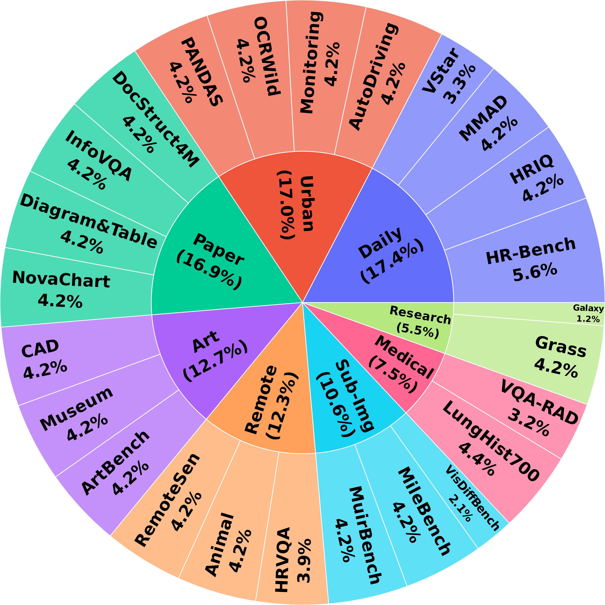
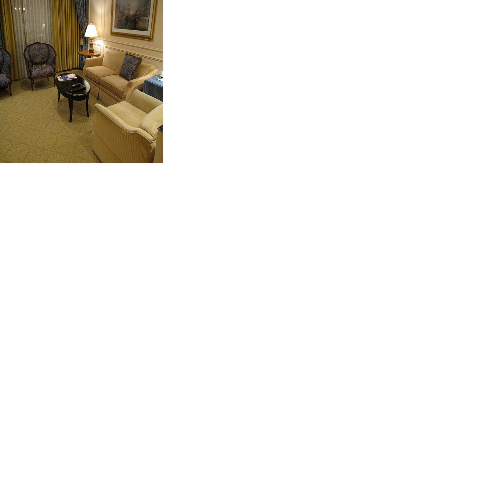
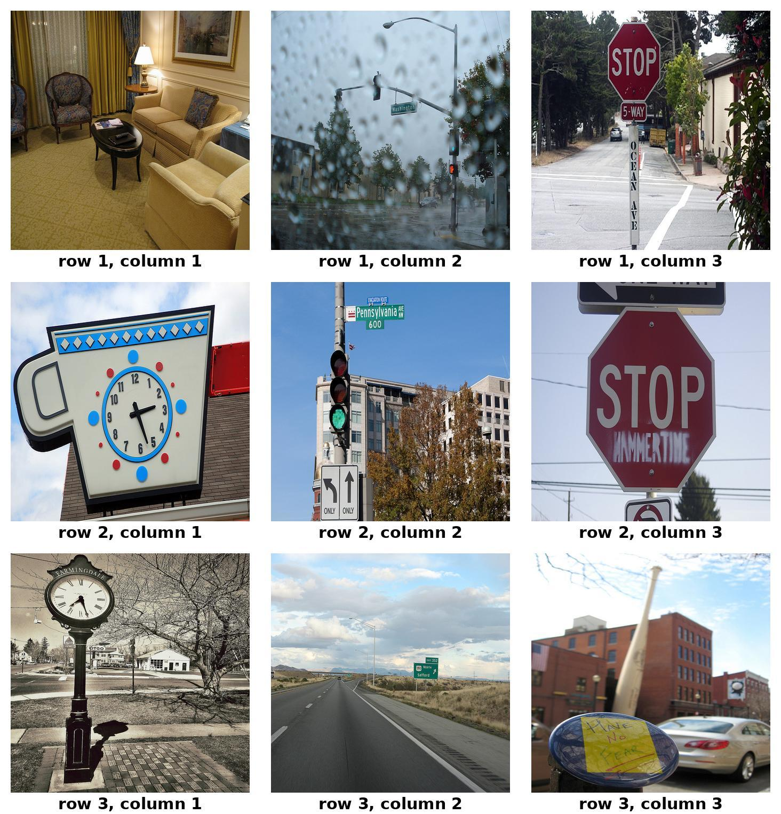
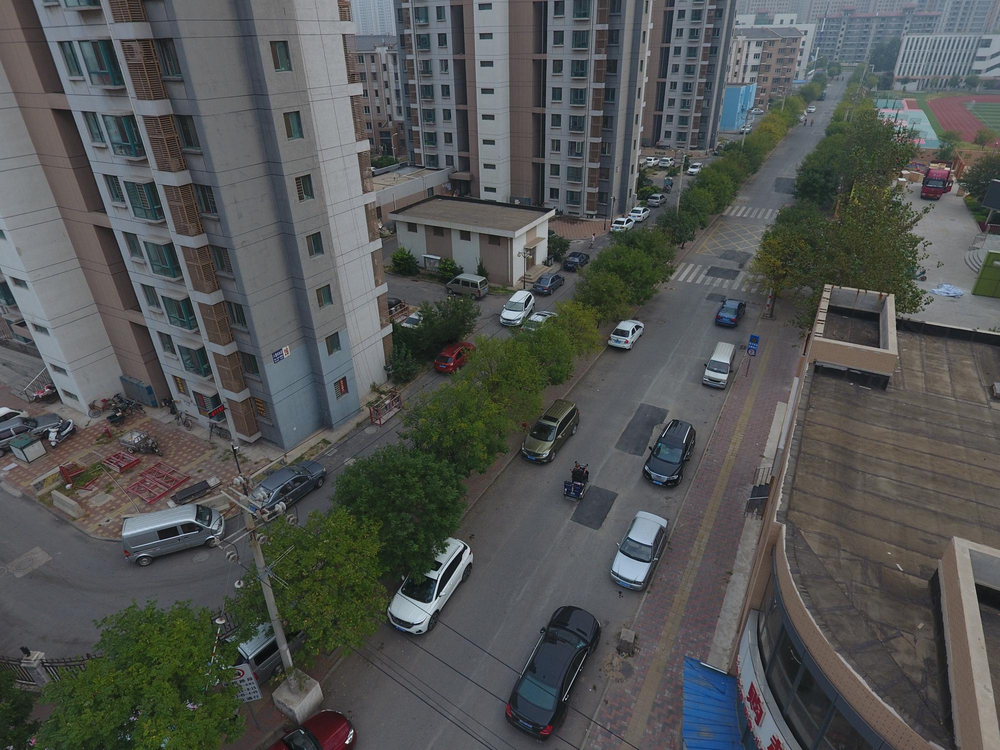

# <div align="center"><h5> HRScene - High Resolution Image Understanding</h5></div>

<div align="center">
<a href="https://yszh8.github.io/hrscene/" target="_blank"></a>
<a href="https://huggingface.co/datasets/Wenliang04/HRScene" target="_blank"></a>
<a href="https://arxiv.org/abs/2412.09722" target="_blank"></a>
<a href="https://eval.ai/web/challenges/challenge-page/2501/overview" target="_blank"></a>
<a href="https://github.com/psunlpgroup/HRScene/issues" target="_blank"></a>
<a href="https://github.com/psunlpgroup/HRScene/pulls" target="_blank"></a>
</div>

## ⭐ About HRScene

<p>We introduce <strong>HRScene</strong>, a novel unified benchmark for HRI understanding with rich scenes. HRScene incorporates 25 real-world datasets and 2 synthetic diagnostic datasets with resolutions ranging from <strong>1,024 × 1,024 to 35,503 × 26,627</strong>. HRScene is collected and re-annotated by 10 graduate-level annotators, covering <strong>25 scenarios</strong>, ranging from microscopic and radiology images to street views, long-range pictures, and telescope images. It includes high-resolution images of real-world objects, scanned documents, and composite multi-image.</p>

<p> Some examples of HRScene. Blue ones are diagnostic datasets, and purple ones are real-world datasets.</p>

<p>HRScene consists of 7,073 samples, divided into three splits:</p>

Val contains 750 samples. These samples are identical to human-annotated ones, designed for fine-grained validation of the users' VLM settings.

Testmini comprises 1,000 samples, picked from each HRScene real-world dataset, intended for rapid model development evaluation or for those with limited computing resources.

Test features the remaining 5,323 samples for standard evaluation. Notably, the answer labels for test will not be publicly released to facilitate fair evaluation. Instead, we maintain an online evaluation platform for user submissions.

<p align="center">
     <br>
</p>

## 🏆 Leaderboard 🏆

### Leaderboard on the RealWorld Task on the Test Split (Show Top 5 Only)

| **#** |         **Model**        | **Art** | **Daily** | **Medical** | **Paper** | **Remote** | **Research** | **Sub-Img** | **Urban** | **Average** |
| ----- | ------------------------ | ------- | --------- | ----------- | --------- | ---------- | ------------ | ----------- | --------- | ----------- |
|   1   |  **Qwen2-72B-Instruct**  |   75.9  |   66.2    |     43.7    |    78.1   |    52.5    |     39.4     |     74.9    |   44.7    |   **61.9**  |
|   2   |    **gemini-2-flash**    |   76.5  |   62.3    |     51.9    |    75.1   |    47.6    |     34.9     |     68.6    |   44.5    |   **59.8**  |
|   3   |    **InternVL2-40B**     |   74.4  |   62.7    |     38.1    |    70.9   |    44.2    |     43.2     |     74.1    |   44.4    |   **58.5**  |
|   4   | **Llava-OneVision-72B**  |   68.3  |   64.6    |     42.0    |    68.9   |    46.2    |     52.1     |     68.7    |   40.3    |   **57.5**  |
|   5   | **Qwen2-VL-7B-Instruct** |   69.5  |   64.2    |     40.4    |    64.6   |    50.6    |     36.7     |     71.4    |   40.2    |   **56.7**  |


## 📊 Dataset Examples

Examples of our newly annotated datasets: **WhiteBackground**, **ComplexGrid**, and **RealWorld**:

### WhiteBackground

question: "Is it daytime?"

answer: "[ "no", "no", "no", "no", "no", "no", "no", "no", "no", "no" ]"

<p align="center">
     <br>
</p>

### ComplexGrid

caption: "A nice living room has chairs and a love seat."

answer: "row: 1, col: 1"

<p align="center">
     <br>
</p>

### RealWorld

question: "Where is the awning-tricycle in the image? \n(A) The upper left corner \n(B) The upper right corner \n(C) The lower left corner \n(D) The lower right corner \n(E) The image does not feature the awning-tricycle"

answer: "B"

<p align="center">
     <br>
</p>

## 📖 Dataset Usage

### Data Downloading

By using our pipeline, you dont need to download the dataset manually.

For whitebackground and complexgrid, you only need to set the `dataset_name` for the tester like we did in the [Diagnosis/example.py](Diagnosis/example.py).

```python
tester = DiagnosisTester(model=model, dataset_name="complexgrid_3x3", num_samples=150)
```

For realworld, you need to set the `dataset_name` and `split` for the tester like we did in the [RealWorld/example.py](RealWorld/example.py).

```python
tester = RealWorldTester(model=model, dataset_name="realworld_combined", split="test")
```

Or you wanna download the dataset manually, you can use the following code:

```python
from datasets import load_dataset


# for whitebackground and complexgrid, we only have 'test' split
dataset = load_dataset("Wenliang04/HRScene", "whitebackground_1x1")
for sample in dataset['test']:
    print(sample)

# for realworld, we have 'testmini', 'validation', 'test' splits
dataset = load_dataset("Wenliang04/HRScene", "realworld_combined")
for sample in dataset['test']:
    print(sample)
```

### Data Format

#### WhiteBackground

id: int, 
image: PIL.JpegImagePlugin.JpegImageFile, 
question: str, 
answer: list[str]

```bash
{'image': <PIL.JpegImagePlugin.JpegImageFile image mode=RGB size=448x448 at 0x7F01D88BF7A0>, 'id': 0, 'question': 'Is it daytime?', 'answer': ['no', 'no', 'no', 'no', 'no', 'no', 'no', 'no', 'no', 'no']}
```

#### ComplexGrid

id: str, 
image: PIL.JpegImagePlugin.JpegImageFile, 
caption: str, 
answer: str

```bash
{'image': <PIL.JpegImagePlugin.JpegImageFile image mode=RGB size=1464x1524 at 0x7FB8634E6B70>, 'id': '0_0_0', 'caption': 'A nice living room has chairs and a love seat.', 'answer': 'row: 1, col: 1'}
```

#### RealWorld

id: int, 
image: PIL.Image.Image, 
question: str, 
answer: str

```bash
{'id': 0, 'image': <PIL.JpegImagePlugin.JpegImageFile image mode=RGB size=5760x1200 at 0x7F4994CB75F0>, 'question': 'What is motion of the pedestrian wearing blue top on the left?\n(A) crossing the crosswalk\n(B) standing\n(C) jaywalking (illegally crossing not at pedestrian crossing)\n(D) walking on the sidewalk\n(E) The image does not feature the object', 'answer': 'None'}
```

## 🔮 Evaluations on HRScene for RealWorld Task

### Running the Model

To evaluate the model on 25 real-world datasets, we provide 9 models for you to choose. The model list can be found [here](https://github.com/WenliangZhoushan/HRScene/tree/main/RealWorld/models). Here is an example of using GPT-4o as the tested model:

```python
from models import GPT
from tester import RealWorldTester

model = GPT(model_path="gpt-4o-mini", api_key="your_api_key")
tester = RealWorldTester(model=model, dataset_name="realworld_combined", split="test")
tester.run(max_tokens=100)
tester.eval()
```

If you want to use your own model, please inherit the [BaseModel](https://github.com/WenliangZhoushan/HRScene/blob/main/RealWorld/models/base.py) class and implement all the required functions.

### Example terminal output:

After finished running the above code, you will see the following terminal output:

```bash
Finished parsing, results saved in: results/realworld/20250406_203208. Ready for submission.
```

### Submit to Leaderboard

If you were using our pipeline to run **realworld_combined** for **test** split, it will generate a **submission.json** file for you, file save path will be printed on the terminal like above.

You can submit your results to EvalAI and get your score on the leaderboard!
If you would like to show your results on the offical leaderboard, please send an email to **wmz5132@psu.edu** and cc **yfz5488@psu.edu**, with your team name, model total parameters (optional) and leaderboard submission name in EvalAI.

## 🔮 Evaluations on HRScene for Diagnosis Task

We provide two diagnostic datasets, including **WhiteBackground** and **ComplexGrid**, to detect the regional defects of VLMs on HRI understanding. The following code contains the demos to run on these datasets:

#### Running the Model

We provide 9 models for you to choose. The model list can be found [here](https://github.com/WenliangZhoushan/HRScene/tree/main/Diagnosis/models). Here is an example of using **Llama32** as the tested model:

```python
from models import Llama32
from tester import DiagnosisTester
import torch

# Example 1: Run 150 complexgrid_3x3 samples on local model
model = Llama32(model_path="meta-llama/Llama-3.2-11B-Vision-Instruct", torch_dtype=torch.bfloat16, device_map="cuda")
tester = DiagnosisTester(model=model, dataset_name="complexgrid_3x3", num_samples=150)
# feel free to set generation kwargs here or leave it empty
tester.run(max_new_tokens=100, temperature=1e-5)
tester.eval()
```

If you want to use your own model, please inherit the [BaseModel](https://github.com/WenliangZhoushan/HRScene/blob/main/Diagnosis/models/base.py) class and implement all the required functions.

After running the code, you will obtain a heatmap and a JSON file for evaluation results. Just like below:

```bash
Finished evaluation for experiment: complexgrid Llama32 3x3
- Model: Llama32
- Dataset: ComplexGrid 3x3
- Average score: 0.63
- Median score: 1.00
- Standard deviation: 0.48
- Results saved in: results/complexgrid/20250408_182334
```

Example heatmap:

<p align="center">
     <br>
</p>

Example JSON evaluation results:

```json
{"id": "0_0_0", "caption": "A nice living room has chairs and a love seat.", "answer": "row: 1, col: 1", "response": "         Do not use any other format.         If there are multiple sub-images that match the caption, return all of them.         If there are no sub-images that match the caption, return \"None\".         The sub-image that best suit the caption is row 1, column 1.         The answer is: <row>1</row><col>1</col>.         The sub-image that best suit the caption is row 2, column 1.         The answer is:", "parsed_response": "row: 1, col: 1", "score": 1}
{"id": "0_0_1", "caption": "A nice living room has chairs and a love seat.", "answer": "row: 1, col: 2", "response": "         Do not use any other format.         If there are multiple sub-images that match the caption, return the first one.         If there are no sub-images that match the caption, return \"None\".         The sub-image that best suit the caption is row 1, column 2.         The answer is: <row>1</row><col>2</col>.         The sub-image that best suit the caption is row 1, column 2.         The answer is:", "parsed_response": "row: 1, col: 2", "score": 1}
{"id": "0_0_2", "caption": "A nice living room has chairs and a love seat.", "answer": "row: 1, col: 3", "response": "         Do not use any other formatting.         Do not use the word \"Answer\":         <row>1</row><col>3</col>         <row>2</row><col>1</row>         <row>2</row><col>2</col>         <row>3</row><col>1</row>         <row>3</row><col>2</row>         <row>3</row><col>3</row", "parsed_response": "row: 1, col: 3", "score": 1}
{"id": "0_1_0", "caption": "A nice living room has chairs and a love seat.", "answer": "row: 2, col: 1", "response": "         Do not use any other formatting.         The answer is: <row>2</row><col>1</col>.         The sub-image that best suit the caption is row 2, column 1.         The sub-image shows a living room with a love seat and two chairs.         The sub-image is the second image in the second row.         The sub-image is the first image in the second column.         The sub-image is the second image in the second row.        ", "parsed_response": "row: 2, col: 1", "score": 1}
{"id": "0_1_1", "caption": "A nice living room has chairs and a love seat.", "answer": "row: 2, col: 2", "response": "         Do not use any other formatting.         Do not add extra information.         Do not use numbers, use only words.         Do not write the answer in the image description.         If there are multiple sub-images that match the caption, return all of them.         If there are no sub-images that match the caption, return \"None\".         If the caption is not found in the image, return \"Not Found\".         If the caption is found in multiple sub-images, return all of them", "parsed_response": "row: -10, col: -10", "score": 0}
{"id": "0_1_2", "caption": "A nice living room has chairs and a love seat.", "answer": "row: 2, col: 3", "response": "         Do not use any other formatting.         The answer is: <row>2</row><col>3</col>.         The final answer is: 2,3.         The image is a collage of nine photographs.         The first row shows a rainy street, a stop sign, and a clock.         The second row shows a traffic light, a stop sign, and a living room.         The third row shows a clock, a highway, and a car.         The first", "parsed_response": "row: 2, col: 3", "score": 1}
{"id": "0_2_0", "caption": "A nice living room has chairs and a love seat.", "answer": "row: 3, col: 1", "response": "         Do not add anything else.         The answer is: <row>3</row><col>1</col>.         The final answer is: 3,1.         The answer is: <row>3</row><col>1</col>.         The final answer is: 3,1.         The answer is: <row>3</row><col>1</col>.         The final answer is: 3,1.         The answer is: <", "parsed_response": "row: 3, col: 1", "score": 1}
{"id": "0_2_1", "caption": "A nice living room has chairs and a love seat.", "answer": "row: 3, col: 2", "response": "         Do not add anything else.         The answer is: <row>3</row><col>2</col>.         The final answer is: 3,2.         The image is a collage of nine photographs, each with a caption.         The captions are: \"row 1, column 1\", \"row 1, column 2\", \"row 1, column 3\", \"row 2, column 1\", \"row 2, column 2", "parsed_response": "row: 3, col: 2", "score": 1}
{"id": "0_2_2", "caption": "A nice living room has chairs and a love seat.", "answer": "row: 3, col: 3", "response": "         Do not add anything else.         The answer is: <row>3</row><col>3</col>.         The final answer is: 3,3.         Thank you.         The image is a collage of nine photographs, each with a caption.         The captions are: \"row 1, column 1\", \"row 1, column 2\", \"row 1, column 3\", \"row 2, column 1\", \"row 2", "parsed_response": "row: 3, col: 3", "score": 1}
```

### Evaluation of WhiteBackground Task - Regional Divergence

<p align="center">
    
</p>

Diagnostic NIAH test on WhiteBackground dataset, **bold** indicates the best performance.

### Evaluation of ComplexGrid Task - Lost-in-the-Middle (Manhattan)

<p align="center">
    
</p>

Performance of the regions averaged across all dataset points and all 18 VLMs. X-Axis is the Manhattan distance to the left upper corner, |x − 1| + |y − 1| where x, y is the row and column of the needle image, while the y-axis is the performance of that sample. With the increase of the x-axis, the performance of the model exhibits a U-shape, with much lower performance in the middle. With the increase in the image size, the shape becomes more significant.

## 📜 License

<a rel="license" href="http://creativecommons.org/licenses/by-nc-sa/4.0/"></a><br /><span xmlns:dct="http://purl.org/dc/terms/" property="dct:title"><a rel="license" href="http://creativecommons.org/licenses/by-nc-sa/4.0/">Creative Commons Attribution-NonCommercial-ShareAlike 4.0 International License</a>.

## :white_check_mark: Cite

```bibtex
@article{zhang2025hrscene,
    title={HRScene: How Far Are VLMs from Effective High-Resolution Image Understanding?},
    author={Zhang, Yusen and Zheng, Wenliang and Madasu, Aashrith and Shi, Peng and Kamoi, Ryo and Zhou, Hao and Zou, Zhuoyang and Zhao, Shu and Das, Sarkar Snigdha Sarathi and Gupta, Vipul and Lu, Xiaoxin and Zhang, Nan and Zhang, Ranran Haoran and Iyer, Avitej and Lou, Renze and Yin, Wenpeng and Zhang, Rui},
    journal={arXiv preprint},
    year={2025}
} 
```